# CHANGELOG:

## 任務尺寸與風險

- 任務尺寸：risk_patch。
- 風險判斷：本輪不改策略門檻與 Telegram 報文，但新增 production evidence table 的非 live handoff builder；風險在於 fake/runtime/local payload 不能被誤轉成 confirmed，也不能讓 Owner 誤以為已完成 live write/backfill。
- 本輪結論摘要：補上 `public.market_theme_confirmed_evidence` 的 repo-side 非 live handoff 入口與 fail-closed 測試；正式 production ingestion/backfill/RLS/smoke 仍是 Owner manual / follow-up。

## 修改內容

- 新增 market/theme evidence handoff builder：
  - 接收已審核 payload rows。
  - 僅允許 `production_db`、`owner_approved_persistent`、`market_data` 這類真實來源家族。
  - 拒絕 runtime、local、cache、worktree、test fixture、report-derived、synthetic、watchlist、theme_classifier 等非正式 source。
  - 只輸出 manual SQL handoff，不執行 Supabase write。
- 新增 SQL renderer：
  - 產生 `insert ... on conflict ... do update` SQL。
  - SQL header 明確標示 manual review/execution only，agent 不得執行。
- 新增 fail-closed 測試：
  - 正向：產出 handoff SQL，但 `confirmed=False`、`handoff_ready=True`、`live_write=False`。
  - 負向：fake/local/runtime/non-confirming/stale/invalid/missing `evidence_status` payload 全部 `insufficient-data` 且無 SQL。
  - 負向：空 payload、非 dict payload 不可 ready。
- QA 反證後修正：
  - 不再把缺失 `evidence_status` 預設為 `confirmed`。
  - `render_market_theme_evidence_handoff_sql()` 即使被直接呼叫，也會先套用同一套 fail-closed validator；invalid / empty / None rows 回傳空 SQL。

## 修改檔案

- `services/market_theme_evidence_store.py`
- `tests/test_market_theme_evidence_handoff.py`

## 最小改動策略

- 只補 `market_theme_confirmed_evidence` 的非 live repo-side handoff builder。
- 不碰 `core/generator.py`、Telegram formatter、策略門檻、watchlist、runner、DB schema、RLS、production write。
- 不把 handoff builder 結果當策略 confirmed；builder 的 `confirmed` 固定為 `False`，只有 Owner 手動執行 SQL 進 production table 後，既有 read-only loader 才能在 GitHub fresh runner 讀到 confirmed/supporting/fresh rows。

## 契約影響

- 新增 public helper：
  - `build_market_theme_evidence_handoff(payloads)`
  - `render_market_theme_evidence_handoff_sql(rows)`
- 新 helper 回傳契約：
  - ready：`status=ready`、`confirmed=False`、`handoff_ready=True`、`live_write=False`、`target_table=public.market_theme_confirmed_evidence`、`rows=[...]`、`sql=<manual SQL>`
  - fail closed：`status=absent` 或 `insufficient-data`、`confirmed=False`、`handoff_ready=False`、`live_write=False`、`rows=[]`、`sql=""`
- DB write contract：沒有 live write；只輸出 Owner 可手動審核/執行的 SQL。
- Telegram / strategy contract：無變更；不升版，仍沿用 `core/generator.py` 的 `v20.4.3`。

## 直接消費者同步

- `services/market_theme_evidence_store.py`：
  - read-only loader 保持既有 contract。
  - 新 handoff builder 與 loader 分離，避免 non-live payload 直接污染 provider。
- `core/market_theme_evidence.py`：
  - 無需同步；仍只消費 production DB loader output。
- `core/generator.py` / GitHub runner：
  - 無需同步；fresh runner 仍從 production DB 讀表，沒有本地 handoff 狀態。
- Owner / Architect：
  - 可使用 handoff SQL 作人工審核與手動 SQL 執行材料。
- QA：
  - 需反證 fake source、local state、stale/weak/strong/rejected payload 不會生成 SQL 或 confirmed。

## DB Usage Matrix

| table/source | writer | reader | strategy consumer | formatter/report consumer | current status | source-of-truth | next action |
| --- | --- | --- | --- | --- | --- | --- | --- |
| positions | Telegram execution function / production DB | `services.position_store` | `core.generator` holdings path | Telegram holdings cards | consumed | production DB | keep |
| position_events | Telegram execution function / production DB | `position_store`, `cross_day_context` | same-day guard / cross-day context | holding action text | consumed | production DB | keep |
| market_theme_confirmed_evidence | non-live handoff SQL builder only; no agent live write | `market_theme_evidence_store` | evidence background only, not BUY threshold | evidence block/provider | read path implemented; write path manual-owner-step | production DB | Owner manual write/backfill/RLS/smoke |
| daily_signal_snapshot | existing snapshot writer | `daily_snapshot_store`, backtest/cross-day readers | backtest/cross-day context | strategy evidence summary | consumed conditional | production DB | data coverage/backfill follow-up |
| daily_price | existing snapshot writer | backtest context | backtest context only | none/direct evidence support | consumed conditional | production DB | verify data coverage |
| signal_runs/items/outcomes | signal history writers | maintenance/update paths; not generator direct source | not direct strategy consumer | reference/audit only | reference-only | production DB | decide whether future strategy should consume |
| strategy_feature_snapshots | strategy evidence writer/backfill | strategy evidence reader/cross-day | non-decision evidence context | strategy evidence summary | consumed | production DB | keep |
| strategy_outcome_metrics | backfill writer visible | strategy evidence reader/cross-day | performance evidence only | strategy evidence summary | consumed conditional | production DB/backfill | outcome writer/backfill status follow-up |
| strategy_classification_audit | audit writer/backfill | evidence reader | audit trace, not buy/sell threshold | warning/summary support | reference/formatter-only | production DB | decide if it should influence decisions |
| market_daily_bars | strategy evidence/backfill writer | no direct generator reader found | none | none | write-only/reference-only | production DB if populated | future reader design or mark reference |

## Market/Theme Evidence 關係圖

```mermaid
flowchart LR
  A["Raw true source<br/>production DB / owner-approved persistent / real market data"] --> B["build_market_theme_evidence_handoff<br/>implemented, non-live"]
  B --> C["Manual SQL handoff<br/>implemented output, Owner manual step"]
  C --> D["public.market_theme_confirmed_evidence<br/>production table exists"]
  D --> E["load_confirmed_market_theme_evidence<br/>read-only implemented"]
  E --> F["build_market_theme_evidence_provider<br/>implemented fail-closed"]
  F --> G["core/generator.py<br/>consumes evidence background"]
  G --> H["Telegram evidence block<br/>no strategy threshold change"]
  H --> I["Strategy influence boundary<br/>does not loosen BUY/SELL/RR/overheat rules"]
```

Status by segment:

| segment | status | note |
| --- | --- | --- |
| raw true source | manual-owner-step | source must be real/persistent; no runtime/report-derived input |
| payload builder | implemented | validates required fields and source family |
| SQL handoff | implemented | manual review/execution only |
| production table | implemented | schema already verified by Owner |
| read-only loader | implemented | existing loader remains fail-closed |
| provider/generator/Telegram | implemented | no threshold change |
| live ingestion/backfill/RLS/smoke | not implemented | follow-up/manual approval required |

## Fresh GitHub Runner Guard

| condition | behavior |
| --- | --- |
| no Supabase env/config | existing loader returns `missing-source`; no confirmed evidence |
| DB error | existing loader returns `source-error`; no confirmed evidence |
| 0 rows | existing loader returns `absent`; no confirmed evidence |
| stale freshness | loader/helper fail closed; handoff builder refuses non-fresh |
| unsupported support_level such as `strong` | handoff builder refuses; loader keeps confirmed set to confirmed/supporting only |
| weak/invalidated/rejected | no handoff SQL; no confirmed evidence |
| missing required fields | handoff builder returns `insufficient-data` |
| local/cache/worktree/runtime/test/report-derived source | handoff builder returns `insufficient-data`; no SQL |
| handoff generated but not manually executed | GitHub runner cannot see it; production loader remains absent/missing-source |

## 未影響模組

- 策略 BUY / SELL / RR / 加減碼 / 停損停利 / 過熱 / 漲停不追：未改。
- Telegram formatter / message list / header：未改。
- `core/generator.py`：未改。
- DB schema / RLS / grant / production SQL：未改。
- Live Supabase write：未執行。
- Formal backfill / replay：未執行。
- Live Telegram：未執行。
- Watchlist / runner secrets / GitHub workflow：未改。

## 已跑自檢命令

- `pytest tests/test_market_theme_evidence_handoff.py`：失敗，裸 `pytest` 不在 PATH。
- `python -m pytest tests/test_market_theme_evidence_handoff.py`：失敗，`python` 不存在。
- `python3 -m pytest tests/test_market_theme_evidence_handoff.py`：失敗，系統 Python 無 pytest。
- `.venv/bin/python -m pytest tests/test_market_theme_evidence_handoff.py -q`：通過，`4 passed in 0.01s`。
- `.venv/bin/python -m pytest tests/test_market_theme_evidence.py`：collection error，既有 `.venv` 在本 runner 以 x86_64 啟動時載入 arm64 pydantic/supabase 依賴失敗。
- `arch -arm64 .venv/bin/python -m pytest tests/test_market_theme_evidence_handoff.py tests/test_market_theme_evidence.py -q`：通過，`25 passed, 17 warnings`；warnings 為既有依賴 deprecation / Python 版本警告。

## 殘留風險

- production ingestion/backfill 尚未完成；目前只產生 manual SQL handoff。
- Owner 尚未執行任何 handoff SQL，因此 production table 可能仍無資料。
- RLS/read-only role/GitHub runner production smoke 尚未在本輪執行。
- `market_daily_bars`、`signal_runs/items/outcomes` 仍不是核心 generator strategy source；已在 matrix 標為 write-only/reference-only，不得假裝已消費。
- Tech runner 兩次卡在交互 prompt，導致 CHANGELOG 需 Architect 整理；這是 runner gap，需記入流程待補。

## 旁支待辦

- Owner-approved 任務：正式 ingestion/backfill 或定期寫入 `market_theme_confirmed_evidence`。
- Owner-approved 任務：production RLS/read-only role/GitHub runner actual data smoke。
- 後續 DB consumption cleanup：決定 `market_daily_bars`、`signal_runs/items/outcomes` 是否要成為策略 reader source。
- Runner 修復：Tech session 不應在已完成 diff 後卡在隨機交互 prompt。
